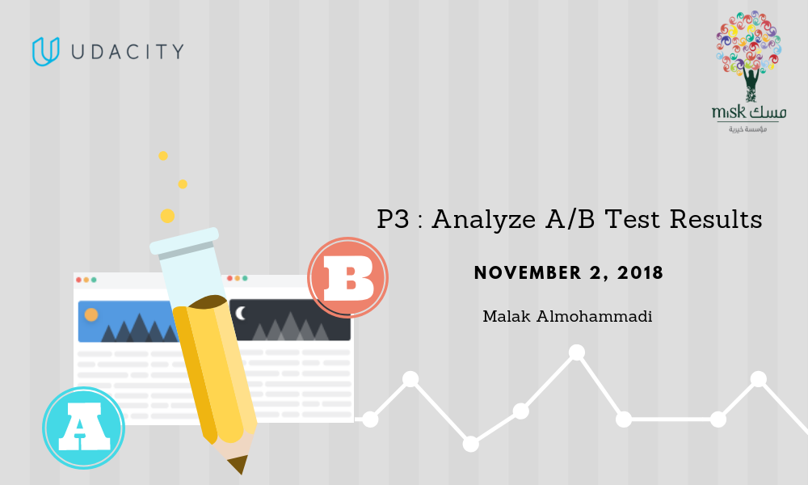
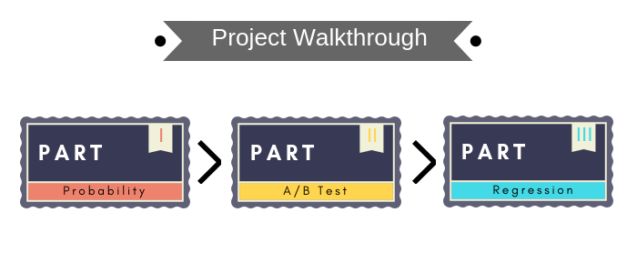

  

## Analyze A/B test results

Matt Gershoff said:
>“Test is really data collection. Personally, I think the winner/loser vocabulary perhaps induces risk adversity.”

### Summary
This is an A/B testing assignment completed for Udacity's Data Analyst Nano Degree Program. The project consisted of understanding the results of an A/B test run by an e-commerce website and helping the company understand through statistical conclusions, if they should implement the new page, keep the old page, or perhaps run the experiment longer to make their decision.

### Objectives
* Practice working on A/B testing projects and their practical difficulties.
* Perform A/B tests and make recommendations backed by computed inferences.

  

  

### Conclusions
1) We accept the Null Hypothesis and Reject the Alternate Hypothesis.
2) The Null Hypothesis said there are no changes in page converted performance between the old and new page.
3) Logistic regression model also doesn't find any changes in page converted performance between the old and new page.
4) We should take consideration of other factors influences whether or not an individual converts.

#### All images desined using [Canva](http://https://www.canva.com) 
